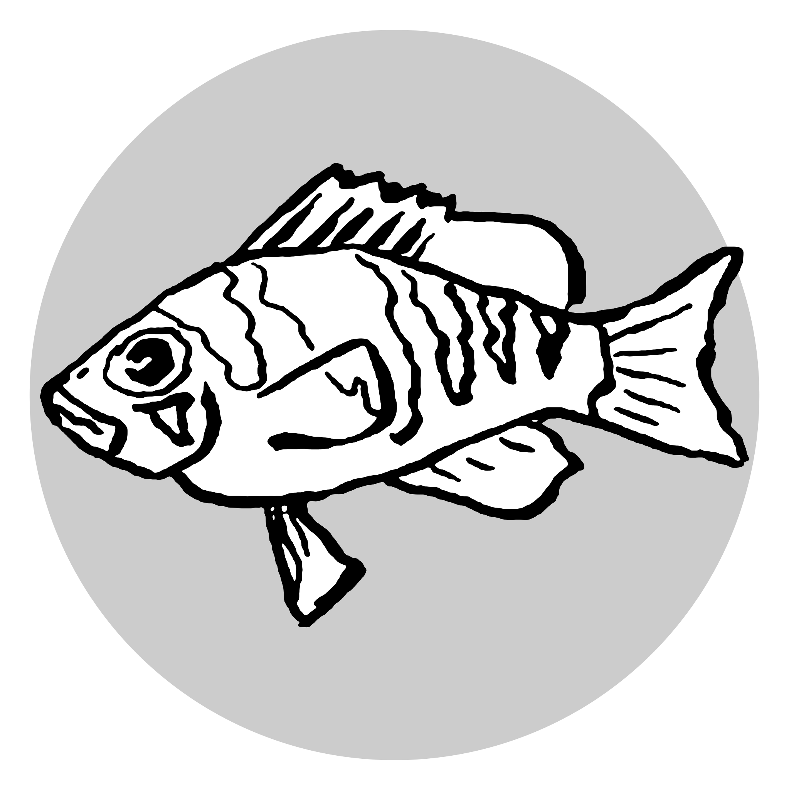

# The **chapter2** repository

This project contains the analysis phylogenetic relationships between hamlet species (*Hypoplectrus* spp) from Belize, Honduras and Panama.

Steps involved include:

- Genotyping from raw sequencing reads (`*.fq.gz` ==> `samples.vcf.gz`) using **GATK4** and phasing using **shapeit2**
- Analysis of divergence (*FST*, *Dxy*, G x P) using **VCFtools**, **popgenWindows.py** (by [Simon Martin](https://github.com/simonhmartin/genomics_general)) and **GEMMA**
- cluster analysis (*PCA* and *phylogenetic trees*) using the **R** package **pcadapt**, **PhyML**/**Fasattree2** in combination with **twisst**, and **structure**/**admixture**

The whole process is monitored using **Nextflow** using the pipeline described in `./main.nf`.

