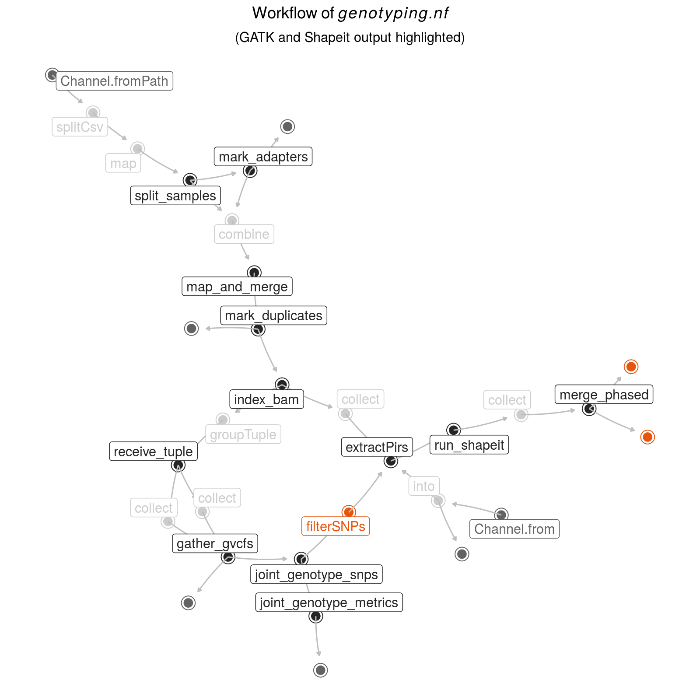

## Summary of the genotyping workflow

Graphical overview of the genotyping.nf pipeline:

---

Short summary of the SNP filtering prcess:

| stage	| spns (n) |
|--------:| --------:|
| intermediate.vcf.gz | 599636340 |
| raw_var_sites.vcf.gz | 48638754 |
| intermediate.filterd.vcf.gz | 31046775 |
| filterd_bi-allelic.vcf.gz | 28912732 |
| phased.vcf.gz | 27537293 |
| phased_mac2.vcf.gz | 23344192 |

---

