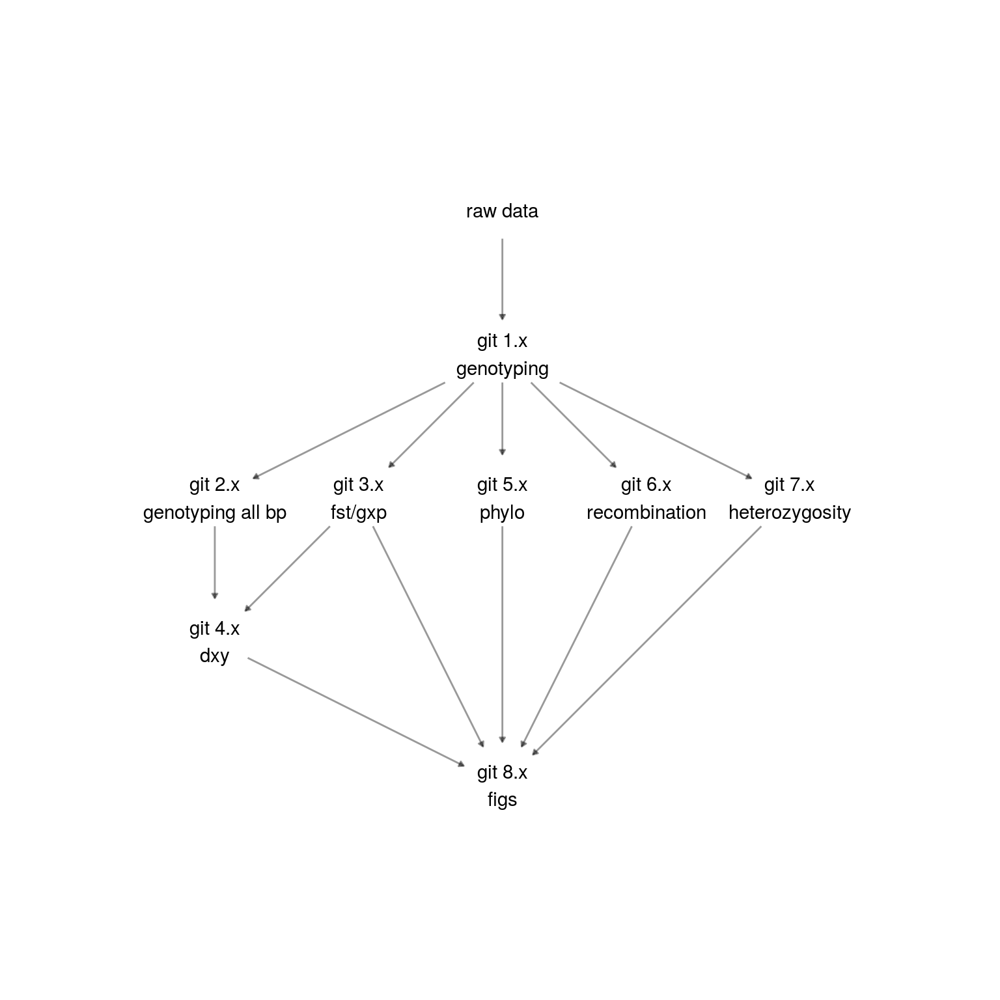

# Intro


[This repository](https://github.com/k-hench/chapter2) contains the complete workflow used in the paper "*Ancestral variation, hybridization and modularity fuel a marine radiation*".
The individual chapters of this documentation follow the separate main steps of the workflow, which each refer to an individual prefix in the _git x.x_ references of the papers method section.
The individual steps partly depend on each other - especially git 1 - git 3 should be executed in order and before the other steps.

<!--<div style="max-width:800px; margin:auto;">

</div> --->

## Analysis

A documentation of the data preparation and the data analysis (git 1.x - 10.x) can be found at:

- git 1.x: [Genotyping](git-1-genotyping-i-snps-only.html)
- git 2.x: [Genotyping all base pairs](git-2-genotyping-ii-all-callable-sites.html)
- git 3.x: [Analysis (<i>F<sub>ST</sub></i> & GxP)](git-3-analysis-i-fst-gxp.html)
- git 4.x: [Analysis (<i>d<sub>XY</sub></i> & $\pi$)](git-4-analysis-ii-dxy-pi.html)
- git 5.x: [Analysis (phylogeny & topolgy weighting)](git-5-analysis-iii-phylogeny-topology-weighting.html)
- git 6.x: [Analysis ($\rho$)](git-6-analysis-iv-rho.html)
- git 7.x: [Analysis (population trees)](git-7-analysis-v-poptrees.html)
- git 8.x: [Analysis (demographic history)](git-8-analysis-vi-demographic-history.html)
- git 9.x: [Analysis (hybridization)](git-9-analysis-vii-hybridization.html)
- git 10.x: [Analysis (admixture)](git-10-analysis-viii-admixture.html)

## Prerequesites

All scripts assume two variables to be set within the bash environment:

  - `$BASE_DIR` is assumed to point to the base folder of this repository
  - `$SFTWR` is a folder that contains all the software dependencies that are used within the scripts

The analysis is controlled using the workflow manager [`nextflow`](https://www.nextflow.io/) and uses slightly different configurations across the individual pipelines. The exact commands used to execute the analysis during the development of the publication are stored within the aliases set within `sh/nextflow_alias.sh`.

Furthermore, external dependencies need to be downloaded and deployed at the expected places (s. README.md at the `ressources` folder).

## Figures

The creation of the figures is bundled in a single script (git 11) which can be executed once all `nextflow` scripts have successfully run.

```sh
cd $BASE_DIR
bash sh/create_figures.sh
```

This is basically just a collection that will run all scripts located under `$BASE_DIR/R/fig`.
Under this location, you will find one `R` script per figure (and suppl. figure).
So if you are only interested in a single figure - that is the place to start looking.

Furthermore, a more detailed documentation exists for all the figure scripts used for the manuscript:

[F1](figure-1.html), [F2](figure-2.html), [F3](figure-3.html), [F4](figure-4.html) and [F5](figure-5.html)

as well as for all the supplementary figures:

[SF1](supplementary-figure-1.html), [SF2](supplementary-figure-2.html), [SF3](supplementary-figure-3.html),
[SF4](supplementary-figure-4.html), [SF5](supplementary-figure-5.html), [SF6](supplementary-figure-6.html),
[SF7](supplementary-figure-7.html), [SF8](supplementary-figure-8.html) and [SF9](supplementary-figure-9.html).
