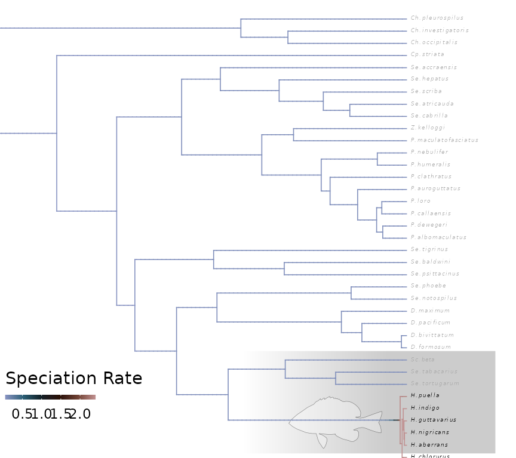
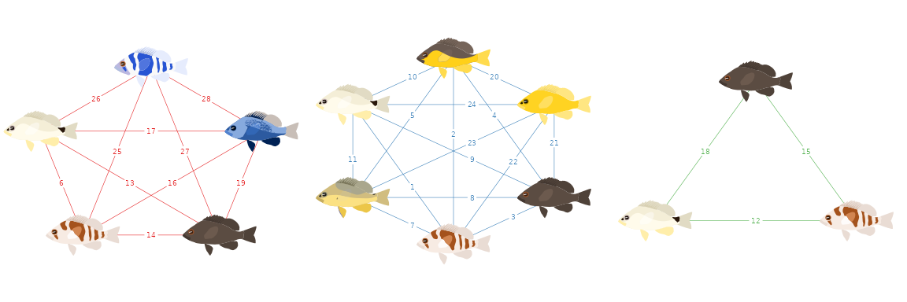
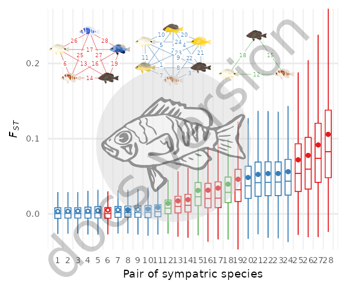

# Figure 1


## Summary

This is the accessory documentation of Figure 1.

> Note that this script depends on results that are created within the script `R/figs/plot_SF15.R` (specifically `2_analysis/summaries/fst_permutation_summary.ts`) and thus needs to be run after this script has finished.

The Figure can be recreated by running the **R** script `plot_F1.R` from a (`bash` terminal):

```sh
cd $BASE_DIR

Rscript --vanilla R/fig/plot_F1.R 2_analysis/dxy/50k/ 2_analysis/fst/50k/

```

## Details of `plot_F1.R`

In the following, the individual steps of the R script are documented.
It is an executable R script that depends on the accessory R package [**GenomicOriginsScripts**](https://k-hench.github.io/GenomicOriginsScripts), [**BAMMtools**](https://cran.r-project.org/web/packages/BAMMtools/) and on the package [**hypoimg**](https://k-hench.github.io/hypoimg).

### Config

The scripts start with a header that contains copy & paste templates to execute interactively or debug the script:


```r
#!/usr/bin/env Rscript
#
# Context: this script depends on the input file 2_analysis/summaries/fst_permutation_summary.tsv
#          which is created by R/figs/plot_SF15.R
#
# run from terminal:
# Rscript --vanilla R/fig/plot_F1.R \
#    2_analysis/fst/50k/ 2_analysis/summaries/fst_globals.txt 2_analysis/summaries/fst_permutation_summary.tsv
# ===============================================================
# This script produces Figure 1 of the study "Ancestral variation, hybridization and modularity
# fuel a marine radiation" by Hench, Helmkampf, McMillan and Puebla
# ---------------------------------------------------------------
# ===============================================================
# args <- c('2_analysis/fst/50k/', '2_analysis/summaries/fst_globals.txt', '2_analysis/summaries/fst_permutation_summary.tsv')
# script_name <- "R/fig/plot_F1.R"
```

The next section processes the input from the command line.
It stores the arguments in the vector `args`.
The needed R packages are loaded and the script name and the current working directory are stored inside variables (`script_name`, `plot_comment`).
This information will later be written into the meta data of the figure to help us tracing back the scripts that created the figures in the future.

Then we drop all the imported information besides the arguments following the script name and print the information to the terminal.


```r
args <- commandArgs(trailingOnly=FALSE)
# setup -----------------------
library(GenomicOriginsScripts)
library(hypoimg)
library(hypogen)
library(patchwork)
library(ape)
library(ggraph)
library(tidygraph)
library(stringr)

cat('\n')
script_name <- args[5] %>%
  str_remove(., '--file=')

plot_comment <- script_name %>%
  str_c('mother-script = ', getwd(), '/', .)

args <- process_input(script_name, args)
```

```r
#> ── Script: R/fig/plot_F1.R ──────────────────────────────────────────────
#> Parameters read:
#>  ★ 1: 2_analysis/fst/50k/
#>  ★ 2: 2_analysis/summaries/fst_globals.txt
#>  ★ 3: 2_analysis/summaries/fst_permutation_summary.tsv
#> ─────────────────────────────────────────── /current/working/directory ──
```
The directories for the different data types are received and stored in respective variables.
Also, we set a few parameters for the plot layout:


```r
# config -----------------------
fst_dir <- as.character(args[1])
fst_globals <- as.character(args[2])
fst_permutation_file <- as.character(args[3])
wdh <- .3          # The width of the boxplots
scaler <- 20       # the ratio of the Fst and the dxy axis (legacy - not really needed anymore)
clr_sec <- 'gray'  # the color of the secondary axis (dxy)
```


### Fish Tree Of Life Subtree

The Figure 1 is assembled from five panels (a-e) which are prepared independently and combined at the end of the R script.

The first panel (a) contains ar re-drawing of a of subset of the data from [@rabosky18data] and also uses builds upon the **R** code from the script `scripts/main figures/Figure3.R` of their [Dryad repository](https://datadryad.org/stash/dataset/doi:10.5061/dryad.fc71cp4).

The code of [@rabosky18data] relies on the packages {BAMMtools} and {geiger} which are loaded additionally to those loaded during the start-up (this is to keep the modified code as close to the original as possible).


```r
# start script -------------------
# === fig 1. panel a: modified plugin from ressources/Rabosky_etal_2018/scripts/main figures/Figure3.R =============
library(BAMMtools)
library(geiger)
```

To be able to handle the tree-plot within a **ggplot** framework, we also need the package {ggplotify} to turn the plot into a grid object.


```r
library(ggplotify)
```

Then, the path to the downloaded Dryad repository is specified and the original helper script `PlottingFunctions.R` from [@rabosky18data] is sourced.


```r
basepath <- 'ressources/Rabosky_etal_2018/'
source(paste0(basepath, "scripts/supporting_fxns/PlottingFunctions.R"))
```

Next, the paths of Fish Tree Of Life (FToL) data are specified and the tree is loaded and prepared according to the original script by [@rabosky18data].


```r
eventdata_vr <- paste0(basepath, "dataFiles/bamm_results/12k_tv1/event_data_thinned.csv")
eventdata_cr <- paste0(basepath, "dataFiles/bamm_results/12k_tc1/event_data_thinned.csv")
treefile <- paste0(basepath, "dataFiles/bamm_results/12k_tv1/bigfish_no_outgroup.tre")
fspdata <- paste0(basepath, "dataFiles/rate_lat_stats_by_sp_fixed0.5.csv")

anadromous <- FALSE

vx <- read.tree(treefile)

# node rotations for plotting:
rset <- c(15447, 15708:15719)
for (i in 1:length(rset)){
  vx <- rotate(vx, node = rset[i])
}

vx <- read.tree(text = write.tree(vx))

spdata <- read.csv(fspdata, stringsAsFactors = F)
rownames(spdata) <- spdata$sp

# ---------------------------

latvals <- abs(spdata$lat_centroid)
names(latvals) <- spdata$sp

inboth <- intersect(spdata$sp, vx$tip.label)

# 1 species is in tree, but was dropped because is synonym to another species in tree according to fishbase (Gadus_ogac matches to Gadus_macrocephalus)
inboth <- intersect(inboth, spdata$sp[which(!is.na(spdata$tv.lambda))]) 

latvals <- latvals[inboth]

edvr <- getEventData(vx, eventdata_vr, burnin=0)
#> Reading event datafile:  ressources/Rabosky_etal_2018/dataFiles/bamm_results/12k_tv1/event_data_thinned.csv 
#> 		...........
#> Read a total of 1000 samples from posterior
#> 
#> Discarded as burnin: GENERATIONS <  1
#> Analyzing  1000  samples from posterior
#> 
#> Setting recursive sequence on tree...
#> 
#> Done with recursive sequence
```

At this point we diverge from the original script and define our own subset of interest, which covers all available species of the Serraninae subfamily.


```r
serranids <- c("Hypoplectrus_gemma", "Hypoplectrus_unicolor", "Hypoplectrus_gummigutta",
               "Hypoplectrus_chlorurus", "Hypoplectrus_aberrans", "Hypoplectrus_nigricans",
               "Hypoplectrus_guttavarius", "Hypoplectrus_indigo", "Hypoplectrus_puella",
               "Serranus_tortugarum", "Serranus_tabacarius", "Schultzea_beta",
               "Diplectrum_formosum", "Diplectrum_bivittatum", "Diplectrum_pacificum",
               "Diplectrum_maximum", "Serranus_notospilus", "Serranus_phoebe",
               "Serranus_psittacinus", "Serranus_baldwini", "Serranus_tigrinus",
               "Paralabrax_albomaculatus", "Paralabrax_dewegeri", "Paralabrax_callaensis",
               "Paralabrax_loro", "Paralabrax_auroguttatus", "Paralabrax_clathratus",
               "Paralabrax_humeralis", "Paralabrax_nebulifer", "Paralabrax_maculatofasciatus",
               "Zalanthias_kelloggi", "Serranus_cabrilla", "Serranus_atricauda",
               "Serranus_scriba", "Serranus_hepatus", "Serranus_accraensis",
               "Centropristis_striata", "Chelidoperca_occipitalis", "Chelidoperca_investigatoris",
               "Chelidoperca_pleurospilus")
```

Then, the data is subset based on the selection.


```r
edvr_serr <- edvr %>% 
  subtreeBAMM(tips = serranids)
```

Next, the species labels are specified and formatted (for those species that have would have an ambiguous family abbreviation based on the first letter).


```r
label_two_chars <- c(`italic(S.~'beta')` = "italic(Sc.~'beta')",
                     `italic(S.~notospilus)` = "italic(Se.~notospilus)",
                     `italic(S.~phoebe)` = "italic(Se.~phoebe)",
                     `italic(S.~psittacinus)` = "italic(Se.~psittacinus)",
                     `italic(S.~baldwini)` = "italic(Se.~baldwini)",
                     `italic(S.~tigrinus)` = "italic(Se.~tigrinus)",
                     `italic(S.~cabrilla)` = "italic(Se.~cabrilla)",
                     `italic(S.~atricauda)` = "italic(Se.~atricauda)",
                     `italic(S.~scriba)` = "italic(Se.~scriba)",
                     `italic(S.~hepatus)` = "italic(Se.~hepatus)",
                     `italic(S.~accraensis)` = "italic(Se.~accraensis)",
                     `italic(C.~striata)` = "italic(Cp.~striata)",
                     `italic(C.~occipitalis)` = "italic(Ch.~occipitalis)",
                     `italic(C.~investigatoris)` = "italic(Ch.~investigatoris)",
                     `italic(C.~pleurospilus)` = "italic(Ch.~pleurospilus)",
                     `italic(S.~tabacarius)` = "italic(Se.~tabacarius)",
                     `italic(S.~tortugarum)` = "italic(Se.~tortugarum)")
```

Then, the labels of the data set are actually re-formatted.


```r
edvr_serr_short <- edvr_serr
edvr_serr_short$tip.label <- edvr_serr$tip.label %>% 
  str_replace(pattern = "([A-Z])[a-z]*_([a-z]*)", "italic(\\1.~\\2)")%>% 
  str_replace(pattern = "beta", "'beta'") %>%
  ifelse(. %in% names(label_two_chars), label_two_chars[.], .) %>% 
  ggplot2:::parse_safe()
```

Now, the color scheme for the tree coloration is defined.


```r
clr_tree <- scico::scico(6, palette = "berlin") %>%
  prismatic::clr_desaturate(shift = .4) %>% 
  prismatic::clr_darken(shift = .2)
```

At this stage, the basic tree is drawn using a modified version of `BAMMtools::plot.bammdata()` (which allows for different colors for the tip labels).


```r
p1 <- as.grob(function(){
  par(mar = c(0,0,0,0))
  bammplot_k(x = edvr_serr_short,
             labels = T,
             lwd = .8, #legend = TRUE,
             cex = .3,
             pal = clr_tree,
             labelcolor = c(rep("black", 9),
                            rep("darkgray", 31)))
  leg_shift_x <- 0
  lines(x = c(0,25) + leg_shift_x,
        y = c(1.5, 1.5),
        col = "darkgray")
  text(x = 12.5 + leg_shift_x,
       y = .5,
       labels = "25 MYR",
       cex = .4, 
       col = "darkgray")
}
)
```

Now that the basic tree is finished, we take care of the annotations starting with the color gradient that is going to highlight the Hypoplectrus family.


```r
c1 <- "transparent"
c2 <- rgb(0, 0, 0, .1)
c3 <- rgb(0, 0, 0, .2)
grad_mat <- c(c1, c2, c3, c3) 
dim(grad_mat) <- c(1, length(grad_mat))
grob_grad <- rasterGrob(grad_mat,
                        width = unit(1, "npc"),
                        height = unit(1, "npc"), 
                        interpolate = TRUE)
```


Then, we create a black hamlet to add to the annotation.


```r
blank_hamlet <- hypoimg::hypo_outline %>% 
  ggplot()+
  coord_equal()+
  geom_polygon(aes(x, y), color = rgb(0, 0, 0, .5), fill = rgb(1, 1, 1, .3), size = .1)+
  theme_void()
```


At this point we have all pieces to assemble panel a of the figure.


```r
p_tree <- ggplot() +
  geom_point(data = tibble(v = c(.056, 2.4)),
             x = .5, y = .5, aes(color = v), alpha = 0)+
  scale_color_gradientn(colours = clr_tree, limits = c(.056, 2.4))+
  annotation_custom(grob = grob_grad,
                    ymin = 0.01, ymax = .2335,
                    xmin = .4, xmax = .96)+
  annotation_custom(grob = ggplotGrob(blank_hamlet),
                    xmin = 0.55, xmax = .75,
                    ymin = 0.015, ymax = .14)+
  annotation_custom(grob = p1,
                    xmin = -.16,
                    xmax = 1.05,
                    ymin = -.22,
                    ymax = 1) +
  coord_cartesian(xlim = c(0, 1),
                  ylim = c(0, 1),
                  expand = 0)+
  guides(color = guide_colorbar(title = "Speciation Rate",
                                title.position = "top",
                                direction = "horizontal",
                                barheight = unit(3, "pt"),
                                barwidth = unit(57, "pt"),
                                ticks.colour = "white")) +
  theme_void()+
  theme(legend.position = c(.01, .08),
        legend.justification = c(0, 0))
```



### Genetic differentiation boxplots

For panel b, the data import starts with collecting the paths to all files containing the $F_{ST}$ data (`dir()`), then iterating the import function over all files (`map(summarize_fst)`) and finally combining the outputs into a single tibble (`bind_rows()`).


```r
# =================================================================================================
# import Fst
fst_files <- dir(fst_dir, pattern = '.50k.windowed.weir.fst.gz')

fst_data <- str_c(fst_dir, fst_files) %>% 
  purrr::map(summarize_fst) %>%
  bind_rows()
```

We use the genome wide average $F_{ST}$ to rank the individual pair wise comparisons.


```r
# determine fst ranking
fst_order <- fst_data %>%
  select(run, `mean_weighted-fst`) %>%
  mutate(run = fct_reorder(run, `mean_weighted-fst`))
```

Then, we transform the $F_{ST}$ data and do quite a bit of data wrangling to prepare the placement of the boxplots.
(This is overly complicated by now, as this is mostly *legacy* code that was create for a previous version of the plot that combined re-scaled $F_{ST}$ and $d_{XY}$ boxplots.)


```r
fst_data_gather <- fst_data %>% 
  gather(key = 'stat', value = 'val', -run) %>%
  # sumstat contains the values needed to plot the boxplots (quartiles, etc)
  separate(stat, into = c('sumstat', 'popstat'), sep = '_') %>%
  # duplicate dxy values scaled to fst range
  mutate(val_scaled = ifelse(popstat == 'dxy', val * scaler , val)) %>%
  unite(temp, val, val_scaled) %>%
  # separate th eoriginal values from the scales ons (scaled = secondary axis)
  spread(., key = 'sumstat', value = 'temp') %>%
  separate(mean, into = c('mean','mean_scaled'),sep = '_', convert = TRUE) %>%
  separate(median, into = c('median','median_scaled'), sep = '_', convert = TRUE) %>%
  separate(sd, into = c('sd','sd_scaled'),sep = '_', convert = TRUE) %>%
  separate(lower, into = c('lower','lower_scaled'), sep = '_', convert = TRUE) %>%
  separate(upper, into = c('upper','upper_scaled'), sep = '_', convert = TRUE) %>%
  separate(lowpoint, into = c('lowpoint','lowpoint_scaled'), sep = '_', convert = TRUE) %>%
  separate(highpoint, into = c('highpoint','highpoint_scaled'), sep = '_', convert = TRUE) %>%
  # include "dodge"-positions for side-by-side plotting (secondary axis)
  mutate(loc = str_sub(run,4,6),
         run = factor(run, levels = levels(fst_order$run)),
         x = as.numeric(run) ,
         x_dodge = ifelse(popstat == 'dxy', x + .25, x - .25),
         x_start_dodge = x_dodge - wdh/2,
         x_end_dodge = x_dodge + wdh/2,
         popstat_loc = str_c(popstat,'[',loc,']'))
```

Then we re-order the species pairs according to their average wheighted $F_{ST}$.


```r
# sort run by average genome wide Fst
run_ord <- tibble(run = levels(fst_data_gather$run),
                  run_ord = 1:length(levels(fst_data_gather$run)))
```

As the last information that is needed for the $F_{ST}$ boxplots, we load the results from the permutation tests (this is the part that depends on `R/figs/plot_SF15.R`).


```r
# load fst permutation results
fst_sig_attach <- read_tsv(fst_permutation_file) %>% 
  mutate(loc = str_sub(run, -3, -1)) %>%
  group_by(loc) %>% 
  mutate(loc_n = 28,#length(loc),
         fdr_correction_factor =  sum(1 / 1:length(loc)),
         fdr_alpha = .05 / fdr_correction_factor,
         is_sig = p_perm > fdr_alpha) %>% 
  ungroup()
```

At this point, the data is ready for the boxplots.

But first, we are going to prepare the networks of pairwise comparisons that are used as annotation of that panel.

For this we create a tibble of the species pairs with their respective rank.
Then, we prepare a config table with one row per location, storing the parameters needed for the layout function for the networks.
We need to define the location, the number of species at the location, the short three letter ID of those species and a weight parameter that is shifting the comparison label on the link within the networks.


```r
# create network annotation
# underlying structure for the network plots
networx <- tibble( loc = c('bel','hon', 'pan'),
                   n = c(5, 6, 3),
                   label = list(str_c(c('ind','may','nig','pue','uni'),'bel'),
                                str_c(c('abe','gum','nig','pue','ran','uni'),'hon'),
                                str_c(c('nig','pue','uni'),'pan')),
                   weight = c(1,1.45,1)) %>%
  purrr::pmap_dfr(network_layout) %>%
  mutate(edges = map(edges, function(x){x %>% left_join(fst_data_gather %>% filter(popstat == "weighted-fst") %>% select(run, median, mean)) }))
```

Next, we create one network plot per location...


```r
# plot the individual networks by location
plot_list <- networx %>%
  purrr::pmap(plot_network, node_lab_shift = .2)
```

...and assemble them into a single grid object.


```r
# combine the networks into a single grob
p_net <- cowplot::plot_grid(
  plot_list[[1]] + theme(legend.position = "none"),
  plot_list[[2]] + theme(legend.position = "none"),
  plot_list[[3]] + theme(legend.position = "none"),
  ncol = 3) %>%
  cowplot::as_grob()
```



At this point we can create panel b.


```r
# assemble panel b
p2 <- fst_data_gather %>%
  filter(popstat == "weighted-fst") %>%
  left_join(fst_sig_attach) %>% 
  mutate(loc = str_sub(run, -3, -1)) %>% 
  ggplot(aes(color = loc)) + 
  annotation_custom(p_net, ymin = .15, xmax = 25)+
  geom_segment(aes(x = x, xend = x,
                   y = lowpoint, yend = highpoint),
               lwd = plot_lwd)+
  geom_rect(aes(xmin = x - wdh, xmax = x + wdh,
                ymin = lower, ymax = upper),
            fill = 'white',
            size = plot_lwd)+
  geom_segment(aes(x = x - wdh,
                   xend = x + wdh,
                   y = median,
                   yend = median),
               lwd = plot_lwd)+
  geom_point(aes(x = x, y = mean, shape = is_sig, fill = after_scale(color)),
             size = .8)+
  scale_x_continuous(name = "Pair of sympatric species",
                     breaks = 1:28) +
  scale_y_continuous(name = expression(italic(F[ST])))+
  scale_color_manual(values = c(make_faint_clr('bel'),
                                make_faint_clr('hon'),
                                make_faint_clr('pan'))[c(2, 4, 6)])+
  scale_shape_manual(values = c(`TRUE` = 1, `FALSE` = 21)) +
  coord_cartesian(xlim = c(0,29),
                  expand = c(0,0))+
  theme_minimal()+
  theme(text = element_text(size = plot_text_size),
        legend.position = 'none',
        strip.placement = 'outside',
        strip.text = element_text(size = 12),
        panel.grid.major.x = element_blank(),
        panel.grid.minor.y = element_blank(),
        axis.text.y.right = element_text(color = clr_sec),
        axis.title.y.right = element_text(color = clr_sec))
```


```
#> Warning in if (!expand) {: the condition has length > 1 and only the first
#> element will be used

#> Warning in if (!expand) {: the condition has length > 1 and only the first
#> element will be used
```



### Principal Component Analyses

Most of the plotting functions for the PCAs are provided in {GenomicOriginsScripts} package, so that the largest part of the work for the PCAs actually concerns the annotations.

Fist, we set an alternative color scale and define the size of the hamlet images.


```r
clr_alt <- clr
clr_alt[["uni"]] <- "lightgray"
pca_fish_scale <- 1.15
```

The we create a configuration tibble that holds the desired positions of the hamlet annotations on the PCAs.


```r
pca_fish_pos <- tibble(pop = GenomicOriginsScripts::pop_levels,
                       short = str_sub(pop, 1, 3),
                       loc = str_sub(pop, 4, 6),
                       width = c(bel = .08, hon =.08, pan = .09)[loc] * pca_fish_scale,
                       height = c(bel = .08, hon =.08, pan = .09)[loc] * pca_fish_scale) %>% 
  arrange(loc) %>%
  mutate(x = c(-.18, -.01, .03, -.03, .075,
               -.04, -.2, -.02, -.01, -.02, -.01,
               -.15, 0, .05),
         y = c(.02, .27, -.13, -.03, .05,
               -.1, .05, 0, .075, -.23, .2,
               .06, -.2, .2)) %>%
  select(-pop) %>%
  group_by(loc) %>%
  nest()
```

Then we create the individual PCA plots using the function `GenomicOriginsScripts::pca_plot()`.


```r
pcas <- c("bel", "hon", "pan") %>% map(pca_plot)
```


### Legend and Final Figure

To create the figure legend we define a set of hamlet species (all sequenced species except the outgroups) with their relative horizontal spacing.


```r
fish_tib <- tibble(short = names(clr)[!names(clr) %in% c("flo", "tab", "tor")],
       x = c(0.5,  3.5,  7,  9.7, 12.25, 15.25, 18, 21.5))
```

Then, we set the color-patch size and create a custom ggplot that is going to function as legend.


```r
key_sz <- .75
p_leg <- fish_tib %>% 
  ggplot() +
  coord_equal(xlim = c(-.05, 24), expand = 0) +
  geom_tile(aes(x = x, y = 0,
                fill = short, 
                color = after_scale(prismatic::clr_darken(fill, .25))),
            width = key_sz, height = key_sz, size = .3) +
  geom_text(aes(x = x + .6, y = 0,
                label = str_c("H. ", sp_names[short])), 
            hjust = 0, fontface = "italic", size = plot_text_size / ggplot2:::.pt) +
  pmap(fish_tib, plot_fish_lwd, width = 1, height = 1, y = 0) +
  scale_fill_manual(values = clr, guide = FALSE) +
  theme_void()
```

After this, first the fice panels are combined...


```r
p_combined <- ((wrap_elements(plot = p_tree +
                                theme(axis.title = element_blank(),
                                      text = element_text(size = plot_text_size)),
                              clip = FALSE) +
                 p2 ) /
                 (pcas %>% wrap_plots()) +
                 plot_layout(heights = c(1,.75)) +
                 plot_annotation(tag_levels = 'a') &
                 theme(text = element_text(size = plot_text_size),
                       plot.background = element_rect(fill = "transparent",
                                                      color = "transparent")))
```

.. and then the legend is attached.


```r
p_done <- cowplot::plot_grid(p_combined, p_leg,
                             ncol = 1, rel_heights = c(1,.06))
```


Finally, we can export Figure 1.


```r
scl <- .75
hypo_save(p_done, filename = 'figures/F1.pdf',
          width = 9 * scl,
          height = 6 * scl,
          device = cairo_pdf,
          bg = "transparent",
          comment = plot_comment)
```

---
