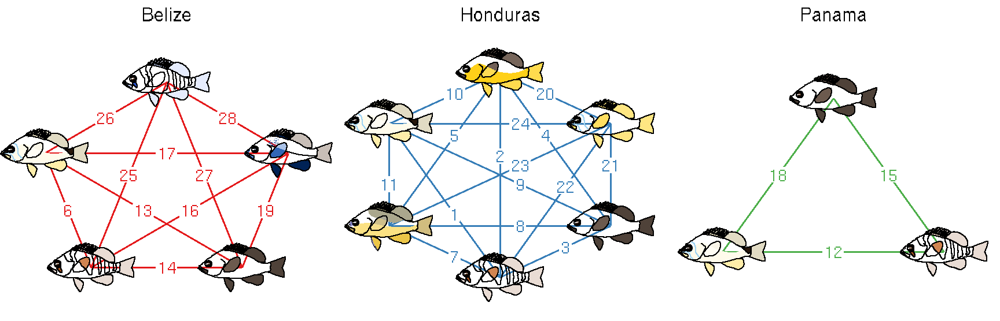
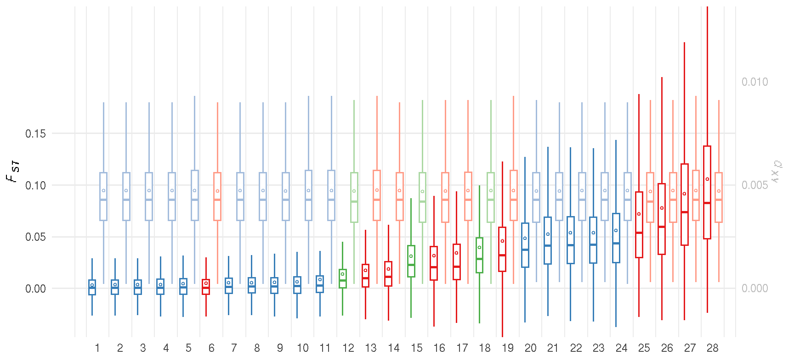

# Figure 1


## Summary

This is the accessory documentation of Figure 1.
The Figure can be recreated by running the **R** script `plot_F1.R`:
```sh
cd $BASE_DIR

Rscript --vanilla R/fig/plot_F1.R 2_analysis/dxy/50k/ 2_analysis/fst/50k/

```

## Details of `plot_F1.R`

In the following, the individual steps of the R script are documented.
It is an executable R script that depends on the accessory R package **GenomicOriginsScripts**.

### Config

The scripts start with a header that contains copy & paste templates to execute or debug the script:


```r
#!/usr/bin/env Rscript
# run from terminal:
# Rscript --vanilla R/fig/plot_F1.R 2_analysis/dxy/50k/ 2_analysis/fst/50k/
# ===============================================================
# This script produces Figure 1 of the study "The genomic origins of a marine radiation"
# by Hench, McMillan an Puebla
# ---------------------------------------------------------------
# ===============================================================
# args <- c('2_analysis/dxy/50k/', '2_analysis/fst/50k/')
```

The next section processes the input from the command line.
It stores the arguments in the vector `args`.
The R package **GenomicOriginsScripts** is loaded and the script name and the current working directory are stored inside variables (`script_name`, `plot_comment`).
This information will later be written into the meta data of the figure to help us tracing back the scripts that created the figures in the future.

Then we drop all the imported information besides the arguments following the script name and print the information to the terminal.


```r
args = commandArgs(trailingOnly=FALSE)
# setup -----------------------
library(GenomicOriginsScripts)
library(hypoimg)

cat('\n')
script_name <- args[5] %>% 
  str_remove(.,'--file=')

plot_comment <- script_name %>% 
  str_c('mother-script = ',getwd(),'/',.) 

args <- process_input(script_name, args)
```

```r
#> ── Script: scripts/plot_F1.R ────────────────────────────────────────────
#> Parameters read:
#>  ★ 1: 2_analysis/dxy/50k/
#>  ★ 2: 2_analysis/fst/50k/
#> ─────────────────────────────────────────── /current/working/directory ──
```
The directories for the different data types are received and stored in respective variables.
Also, we set a few parameters for the plot layout:


```r
# config -----------------------
dxy_dir <- as.character(args[1])
fst_dir <- as.character(args[2])
wdh <- .3          # The width of the boxplots
scaler <- 20       # the ratio of the Fst and the dxy axis
clr_sec <- 'gray'  # the color of the secondary axis (dxy)
```

### Data import

We begin with the data import by first collecting the paths to all files containing either *F<sub>ST</sub>* or *d<sub>XY</sub>* data (`dir()`), then iterating the import function over all files (`map(summarize_fst)`) and finally combining the outputs into a single tibble (`bind_rows()`).
This is done for both *F<sub>ST</sub>* and *d<sub>XY</sub>*.


```r
# start script -------------------

# import Fst 
fst_files <- dir(fst_dir, pattern = '.50k.windowed.weir.fst.gz')

fst_data <- str_c(fst_dir,fst_files) %>%
  purrr::map(summarize_fst) %>%
  bind_rows()

# import dxy 
dxy_files <- dir(dxy_dir)

dxy_data <-  str_c(dxy_dir,dxy_files) %>%
  purrr::map(summarize_dxy) %>%
  bind_rows()
```


We use the genome wide average *F<sub>ST</sub>* to rank the individual pair wise comparisons.


```r
fst_order <- fst_data %>% 
  select(run, `mean_weighted-fst`) %>%
  mutate(run = fct_reorder(run,`mean_weighted-fst`))
```

Then, we merge the *F<sub>ST</sub>* and *d<sub>XY</sub>* data sets and do quite a bit of data wrangling to create a rescaled *d<sub>XY</sub>* value and to prepare the placement of the boxplots.


```r
data <- left_join(fst_data, dxy_data) %>%
  select(c(8,1:7,9:15)) %>%
  # transfrom table from short to long format 
  gather(key = 'stat', value = 'val',2:15) %>%
  # separating the boxplot element from the population genetic parameter
  separate(stat, into = c('sumstat','popstat'),sep = '_') %>%
  # rescaleing the dxy values to fall in the range of Fst
  mutate(val_scaled = ifelse(popstat == 'dxy', val * scaler , val)) %>% 
  # combining original and rescaled values 
  unite(temp, val, val_scaled) %>%
  # back transforming to short format
  spread(.,key = 'sumstat',value = 'temp') %>%
  # separating original and rescaled values for all boxplot elements
  separate(mean, into = c('mean','mean_scaled'),sep = '_', convert = TRUE) %>%
  separate(median, into = c('median','median_scaled'),sep = '_', convert = TRUE) %>%
  separate(sd, into = c('sd','sd_scaled'),sep = '_', convert = TRUE) %>%
  separate(lower, into = c('lower','lower_scaled'),sep = '_', convert = TRUE) %>%
  separate(upper, into = c('upper','upper_scaled'),sep = '_', convert = TRUE) %>%
  separate(lowpoint, into = c('lowpoint','lowpoint_scaled'),sep = '_', convert = TRUE) %>%
  separate(highpoint, into = c('highpoint','highpoint_scaled'),sep = '_', convert = TRUE) %>%
  # adding preparations for plotting
  mutate(loc = str_sub(run,4,6),                             # extract location from run
         run = factor(run, levels = levels(fst_order$run)),  # introduce the run ranking
         x = as.numeric(run) ,                               # extract rank of runs (base x)
         x_dodge = ifelse(popstat == 'dxy',x + .25,x - .25), # shift dxy to the right, fst left
         x_start_dodge = x_dodge - wdh/2,                    # boxplot left border
         x_end_dodge = x_dodge + wdh/2,                      # boxplot right border
         popstat_loc = str_c(popstat,'[',loc,']'))           # parameter X location (for color) 
```

At this point, the data is ready for the boxplots.
But first we are going to prepare the networks of pairwise comparisons.

For this we create a tibble of the runs with their respective rank.
Then, we prepare a config table with one row per location, storing the parameters neede for the layout function for the networks.
We need to define the location, the number of species at the location, the short three letter ID of those species and a wheight parameter that is shifting the comparison label on the link within the networks.

Finally, we create one network plot per location.


```r
# preparing a run/rnk lookup table
run_ord <- tibble(run = levels(data$run),
       run_ord = 1:length(levels(data$run)))

# network config and layout
networx <- tibble( loc = c('bel','hon', 'pan'), 
                   n = c(5,6,3),
                   label = list(str_c(c('ind','may','nig','pue','uni'),'bel'),
                                str_c(c('abe','gum','nig','pue','ran','uni'),'hon'),
                                str_c(c('nig','pue','uni'),'pan')),
                   weight = c(1,1.45,1)) %>% 
  purrr::pmap(network_layout) %>%
  bind_rows()

plot_list <- networx %>%
  purrr::pmap(plot_network, node_lab_shift = .2)
```

### Plotting

To create the first panel of Figure 1, we combine the three networks and label the locations.


```r
p1 <- cowplot::plot_grid(
  grid::textGrob('Belize'),
  grid::textGrob('Honduras'),
  grid::textGrob('Panama'),
  plot_list[[1]], plot_list[[2]], plot_list[[3]], 
  ncol = 3, rel_heights = c(.1,1))
```

<center>

</center>

Now, we can create the second panel of Figure 1, by plotting our prepared data tibble.
We are going to plot each boxplot element as a single layer.
(This, might seem a little cumbersome given `geom_boxplot()`, but this approach was choosen for specific fine tuning of the postioning, dropping of outliers and reducing runtime during the plotting phase - otherwise the entire genome wide data set would have been carried though whole script.)


```r
p2 <- data %>%
  ggplot(aes(color = popstat_loc)) +
  # adding whiskers
  geom_segment(aes(x = x_dodge, xend = x_dodge, 
                   y = lowpoint_scaled,yend = highpoint_scaled)) +
  # adding box (inter quartile range)
  geom_rect(aes(xmin = x_start_dodge, xmax = x_end_dodge,
                ymin = lower_scaled, ymax = upper_scaled), 
             fill='white')+
  # adding bar (median)
  geom_segment(aes(x = x_start_dodge,
                   xend = x_end_dodge,
                   y = median_scaled,
                   yend = median_scaled),lwd = .9)+
  # adding point (mean)
  geom_point(aes(x = x_dodge, y = mean_scaled),shape = 21, size = .7, fill = 'white')+
  # layout x ayis
  scale_x_continuous(breaks = 1:28) +
  # layout primary y axis (Fst)
  scale_y_continuous(breaks = c(0,.05,.1,.15),
                     name = expression(italic(F[ST])),
                     # layout secondary y axis (dxy)
                     sec.axis = sec_axis(~ . /scaler,
                                         name = expression(italic(d[XY])), 
                                         breaks = c(0,.005,.01)))+
  # define color scheme
  scale_color_manual(values = c(make_faint_clr('bel'),
                                make_faint_clr('hon'),
                                make_faint_clr('pan'))[c(1,3,5,2,4,6)])+
  # set plot range
  coord_cartesian(xlim = c(-1,29),
                  expand = c(0,0))+
  # tune plot appreance
  theme_minimal()+
  theme(axis.title.x = element_blank(),
        legend.position = 'none',
        strip.placement = 'outside',
        strip.text = element_text(size = 12),
        panel.grid.major.x = element_blank(),
        panel.grid.minor.y = element_blank(),
        axis.text.y.right = element_text(color = clr_sec),
        axis.title.y.right = element_text(color = clr_sec))
```

<center>

</center>

To create the final figure, we combine the two sub panels unsing the **cowplot** package.
Here, we add the panel labels and define the space each panel is going to take.


```r
p_done <- cowplot::plot_grid(p1,p2,
                             ncol = 1,
                             rel_heights = c(.7,1),
                             labels = letters[1:2] %>% project_case())
```

<center>

</center>

Finally, we can export Figure 1.


```r
hypo_save(p_done, filename = 'figures/F1.pdf',
          width = 9, height = 7,
          comment = plot_comment)
```


The function `hypo_save()` is simply a wrapper around `ggsave()`, that will write the name of the currently running script into the meta data of the plot (after the plot has been exported).
The benfit of this is that you can read this information later to remember how a specifc plot was created using `hypo_show_metadata()`.
This is done using [exiftool](https://www.sno.phy.queensu.ca/~phil/exiftool/) and has currently only been tested on my linux system.
If this does not work for you, simple replace `hypo_save()` with `ggsave()` and drop the `comment` parameter.

```r
hypo_show_metadata('figures/F1.pdf')
```

```r
#> [1] "mother-script = /path/to/scripts/plot_F1.R"
```
---
