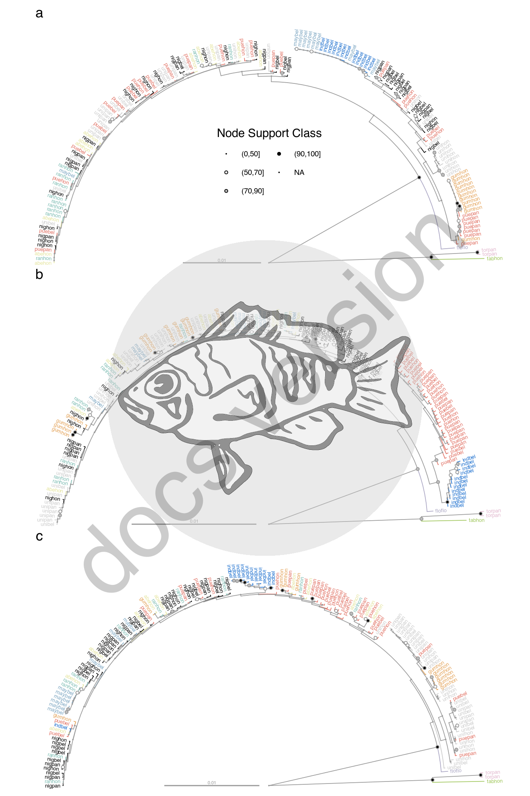

# Supplementary Figure 12


## Summary

This is the accessory documentation of Figure S12.
The Figure can be recreated by running the **R** script `plot_SF12.R`:

```sh
cd $BASE_DIR

Rscript --vanilla R/fig/plot_SF12.R \
  2_analysis/raxml/lg04.1_hySN.raxml.support \
  2_analysis/raxml/lg12.3_hySN.raxml.support \
  2_analysis/raxml/lg12.4_hySN.raxml.support
```

## Details of `plot_SF12.R`

In the following, the individual steps of the R script are documented.
It is an executable R script that depends on the accessory R package [**GenomicOriginsScripts**](https://k-hench.github.io/GenomicOriginsScripts) and on the packages [**hypoimg**](https://k-hench.github.io/hypoimg), [**hypogen**](https://k-hench.github.io/hypogen), [**ape**](http://ape-package.ird.fr/), [**ggtree**](https://github.com/YuLab-SMU/ggtree), [**patchwork**](https://patchwork.data-imaginist.com/) and [**phangorn**](https://github.com/KlausVigo/phangorn).

### Config

The scripts start with a header that contains copy & paste templates to execute or debug the script:


```r
#!/usr/bin/env Rscript
# run from terminal:
# Rscript --vanilla R/fig/plot_SF12.R 2_analysis/raxml/lg04.1_hySN.raxml.support \
#    2_analysis/raxml/lg12.3_hySN.raxml.support \
#    2_analysis/raxml/lg12.4_hySN.raxml.support
# ===============================================================
# This script produces Suppl. Figure 12 of the study "Ancestral variation,
# hybridization and modularity fuel a marine radiation"
# by Hench, Helmkampf, McMillan and Puebla
# ---------------------------------------------------------------
# ===============================================================
# args <- c("2_analysis/raxml/lg04.1_hySN.raxml.support",
#           "2_analysis/raxml/lg12.3_hySN.raxml.support",
#           "2_analysis/raxml/lg12.4_hySN.raxml.support")
# script_name <- "R/fig/plot_SF12.R"
```

The next section processes the input from the command line.
It stores the arguments in the vector `args`.
The needed R packages are loaded and the script name and the current working directory are stored inside variables (`script_name`, `plot_comment`).
This information will later be written into the meta data of the figure to help us tracing back the scripts that created the figures in the future.

Then we drop all the imported information besides the arguments following the script name and print the information to the terminal.


```r
args <- commandArgs(trailingOnly = FALSE)
# setup -----------------------
library(GenomicOriginsScripts)
library(hypoimg)
library(hypogen)
library(ape)
library(ggtree)
library(patchwork)
library(phangorn)

cat('\n')
script_name <- args[5] %>%
  str_remove(., '--file=')

plot_comment <- script_name %>%
  str_c('mother-script = ', getwd(), '/', .)

args <- process_input(script_name, args)
```

```r
#> ── Script: R/fig/plot_SF12.R ────────────────────────────────────────────
#> Parameters read:
#> ★ 1: 2_analysis/raxml/lg04.1_hySN.raxml.support
#> ★ 2: 2_analysis/raxml/lg12.3_hySN.raxml.support
#> ★ 3: 2_analysis/raxml/lg12.4_hySN.raxml.support
#> ────────────────────────────────────────── /current/working/directory ───
```

The paths the phyplogenic trees are received and stored inside more descriptive variable.


```r
# config -----------------------
tree_file_lg04_1 <- as.character(args[1])
tree_file_lg12_3 <- as.character(args[2])
tree_file_lg12_4 <- as.character(args[3])
```

Then, the trees are being read in and rooted using the Serranus samples as outgroup. 


```r
trees <- c(tree_file_lg04_1, tree_file_lg12_3, tree_file_lg12_4) %>% 
  map(.f = function(file){
    read.tree(file) %>%
      root(phy = ., outgroup = c("28393torpan", "s_tort_3torpan", "20478tabhon" )) %>% 
    midpoint()}
  )
```

Next, the default tree layout is defined and the default tree color is set.


```r
clr_neutral <- rgb(.6, .6, .6)
lyout <- 'circular'
```

Now, the support values of the tree are transformed into discrete support classes.


```r
tree_data <- trees %>% 
  map(.f = function(tree_in){
    open_tree(ggtree(tree_in, 
                     layout = lyout), 180) %>%
      .$data %>% 
      mutate(spec = ifelse(isTip, str_sub(label, -6, -4), "ungrouped"),
             support = as.numeric(label),
             support_class = cut(support, c(0,50,70,90,100)) %>% 
               as.character() %>% factor(levels = c("(0,50]", "(50,70]", "(70,90]", "(90,100]"))
      )}
  )
```

After this, the individual trees are being drawn one by one.


```r
p1 <- plot_outl_tree_s(tree_data[[1]])
p2 <- plot_outl_tree_s(tree_data[[2]], show_legend = FALSE)
p3 <- plot_outl_tree_s(tree_data[[3]], show_legend = FALSE)
```


All three trees are combined to create the final figure.


```r
p_done <- p1 + p2 + p3 + plot_annotation(tag_levels = 'a') + plot_layout(ncol = 1)
```



Finally, we can export Figure S12.


```r
scl <- 2
hypo_save(plot = p_done,
          filename = "figures/SF12.pdf",
          width = f_width_half * scl,
          height = f_width_half * 1.5 * scl,
          device = cairo_pdf,
          bg = "transparent",
          comment = plot_comment)
```

---
