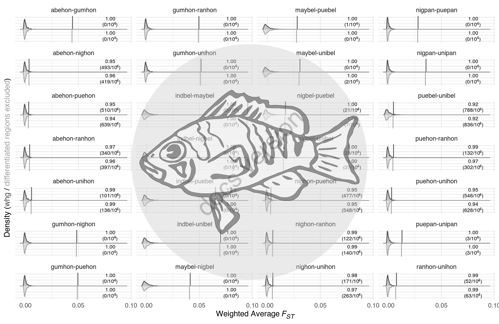

# Supplementary Figure 15


## Summary

This is the accessory documentation of Figure S15.
The Figure can be recreated by running the **R** script `plot_SF15.R`:

```sh
cd $BASE_DIR

Rscript --vanilla R/fig/plot_SF15.R 

```

## Details of `plot_SF15.R`

In the following, the individual steps of the R script are documented.
It is an executable R script that depends on the accessory R package [**GenomicOriginsScripts**](https://k-hench.github.io/GenomicOriginsScripts), as well as on the packages [**ggtext**](https://wilkelab.org/ggtext/), [**hypoimg**](https://k-hench.github.io/hypoimg) and [**hypogen**](https://k-hench.github.io/hypogen).

### Config

The scripts start with a header that contains copy & paste templates to execute or debug the script:


```r
#!/usr/bin/env Rscript
# run from terminal:
# Rscript --vanilla R/fig/plot_SF15.R 2_analysis/fst_signif/random/
# ===============================================================
# This script produces Suppl. Figure 15 of the study "Ancestral variation,
# hybridization and modularity fuel a marine radiation"
# by Hench, Helmkampf, McMillan and Puebla
# ---------------------------------------------------------------
# ===============================================================
# args <- c("2_analysis/fst_signif/random/")
# script_name <- "R/fig/plot_SF15.R"
```

The next section processes the input from the command line.
It stores the arguments in the vector `args`.
The needed R packages are loaded and the script name and the current working directory are stored inside variables (`script_name`, `plot_comment`).
This information will later be written into the meta data of the figure to help us tracing back the scripts that created the figures in the future.

Then we drop all the imported information besides the arguments following the script name and print the information to the terminal.


```r
args <- commandArgs(trailingOnly = FALSE)
# setup -----------------------
library(GenomicOriginsScripts)
library(hypogen)
library(hypoimg)
library(ggtext)

cat('\n')
script_name <- args[5] %>%
  str_remove(., '--file=')

plot_comment <- script_name %>%
  str_c('mother-script = ', getwd(), '/', .)

args <- process_input(script_name, args)
```

```r
#> ── Script: R/fig/plot_SF15.R ────────────────────────────────────────────
#> Parameters read:
#> ★ 1: 2_analysis/fst_signif/random/
#> ─────────────────────────────────────────── /current/working/directory ──
```

The $F_{ST}$ permutation data the hybridization data is received and stored in a variable.
After that, all files within the data folder are collected.


```r
# config -----------------------
rand_path <- as.character(args[1])
rand_files <- dir(path = rand_path, pattern = "_random_fst.tsv.gz")
```

Next, the data is read in.


```r
data <- str_c(rand_path, rand_files) %>%
  map_dfr(.f = get_random_fst) %>% 
  mutate(sign = c(subset_non_diverged = -1, whg = 1)[subset_type])
```

Then the data is nested with respect to permutation group and summary statistics are computed.


```r
data_grouped <- data %>% 
  group_by(group, run, subset_type, sign) %>%
  nest() %>%
  ungroup() %>% 
  mutate(real_pop = map_dbl(data, function(data){data$weighted_fst[data$type == "real_pop"]}),
         percentile = map_chr(data, get_percentile),
         above = map_dbl(data, get_n_above),
         total = map_dbl(data, get_n_total),
         label = str_c(sprintf("%.2f", as.numeric(percentile)), "<br>(",above, "/10<sup>",log10(total),"</sup>)")) %>%
  arrange(-sign, -as.numeric(percentile), -real_pop)
```

Now, the species pairs are ordered according to their original genome wide average $F_{ST}$.


```r
run_lvls <- data_grouped %>% filter(sign == 1) %>%
  mutate(rank = row_number(),
         run = fct_reorder(run, rank)) %>% 
  .$run %>%  levels()
```

The species pair order is also updated for the nested version of the data.


```r
data_grouped_ordered <- data_grouped %>% 
  mutate(run = factor(run, levels = run_lvls))
```

At this point, the figure can be plotted.


```r
p_done <- data %>%
  mutate(run = factor(run, levels = run_lvls)) %>%
  filter(type == "random") %>%
  ggplot(aes(group = group)) +
  geom_segment(data = data %>%
               mutate(run = factor(run, levels = run_lvls)) %>%
               filter(type == "real_pop"),
             aes(x = weighted_fst,
                 xend = weighted_fst,
                 y = 0,
                 yend = Inf * sign,
                 color = subset_type)) +
  geom_density(data = data %>%  filter(sign == 1),
                aes( x = weighted_fst, y = ..density..,
                     color = subset_type,
                     fill = after_scale(prismatic::clr_alpha(color,alpha = .3)))) +
  geom_density(data = data %>%  filter(sign == -1),
                 aes( x = weighted_fst, y = ..density.. * -1,
                      color = subset_type,
                      fill = after_scale(prismatic::clr_alpha(color,alpha = .3)))) +
  geom_richtext(data = data_grouped_ordered,
                 aes(x = .08, y = 300 * sign,
                     label = label),
                 hjust = .5, 
                 vjust = .5,
                 size = 2.5,
                 label.padding = unit(3,"pt"),
                 label.size = 0,
                 label.color = "transparent",
                 fill = "transparent") +
  scale_x_continuous(breaks = c(0, .05, .1)) +
  scale_color_manual(values = c(whg = "#4D4D4D", 
                                subset_non_diverged = "#A2A2A2"),
                     guide = FALSE) +
  labs( y = "Density (<span style='color:#4D4D4D'>whg</span> / <span style='color:#A2A2A2'>differentiated regions excluded</span>)",
        x = "Weighted Average <i>F<sub>ST</sub></i>") +
  facet_wrap(run ~ ., ncol = 4, dir = "v") +
  theme_minimal() +
  theme(axis.text.y = element_blank(),
        axis.ticks.y = element_blank(),
        axis.title.y = element_markdown(),
        axis.title.x = element_markdown())
```



Finally, we can export Figure S15.


```r
scl <- 1.4
hypo_save(p_done, filename = 'figures/SF15.pdf',
          width = f_width * scl,
          height = f_width * .65 * scl,
          device = cairo_pdf,
          comment = plot_comment,
          bg = "transparent")
```

After this, a subset of the data is created...


```r
# export significance table

data_export <- data_grouped %>%
  select(run, real_pop, subset_type, percentile) %>%
  mutate(pre = run,
         p_perm = 1 - as.numeric(percentile)) %>%
  separate(pre, into = c("p2", "p1"))
```

...and exported for use for the plotting of Figure 1 (`plot_F1.R`).


```r
write_tsv(x = data_export, file = "2_analysis/summaries/fst_permutation_summary.tsv")
```

Finally, this subset is also used to compute the empirical **p** values and apply the false discovery rate correction for significance:


```r
# fdr correction (only for visual check)
data_export %>% 
  mutate(loc = str_sub(run, -3, -1)) %>%
  group_by(loc) %>% 
  mutate(loc_n = 28,
         fdr_correction_factor =  sum(1 / 1:loc_n[[1]]),
         fdr_alpha = .05 / fdr_correction_factor,
         is_sig = p_perm > fdr_alpha) %>% 
  ungroup() %>% 
  select(run,real_pop, p_perm, loc_n, subset_type, fdr_correction_factor, fdr_alpha) %>% 
  mutate(`050` = .05/ fdr_correction_factor,
         `010` = .01/ fdr_correction_factor,
         `001` = .001/ fdr_correction_factor,
         sig = ifelse(p_perm < `001`, "***", ifelse(p_perm < `010`, "**", ifelse(p_perm < `050`, "*", "-")))) %>% 
arrange(as.character(run)) %>% 
  select(run, subset_type, sig,real_pop, p_perm) %>% 
  mutate(real_pop = sprintf("%.4f",real_pop),
         p_perm = sprintf("%.2f",p_perm * 100))
```

```
## # A tibble: 56 x 5
##    run           subset_type         sig   real_pop p_perm
##    <chr>         <chr>               <chr> <chr>    <chr> 
##  1 abehon-gumhon whg                 ***   0.0445   0.00  
##  2 abehon-gumhon subset_non_diverged ***   0.0440   0.00  
##  3 abehon-nighon whg                 -     0.0033   4.93  
##  4 abehon-nighon subset_non_diverged -     0.0032   4.19  
##  5 abehon-puehon whg                 -     0.0030   5.11  
##  6 abehon-puehon subset_non_diverged -     0.0026   6.39  
##  7 abehon-ranhon whg                 -     0.0039   3.40  
##  8 abehon-ranhon subset_non_diverged -     0.0037   3.97  
##  9 abehon-unihon whg                 *     0.0057   1.01  
## 10 abehon-unihon subset_non_diverged -     0.0053   1.36  
## # … with 46 more rows
```

---
