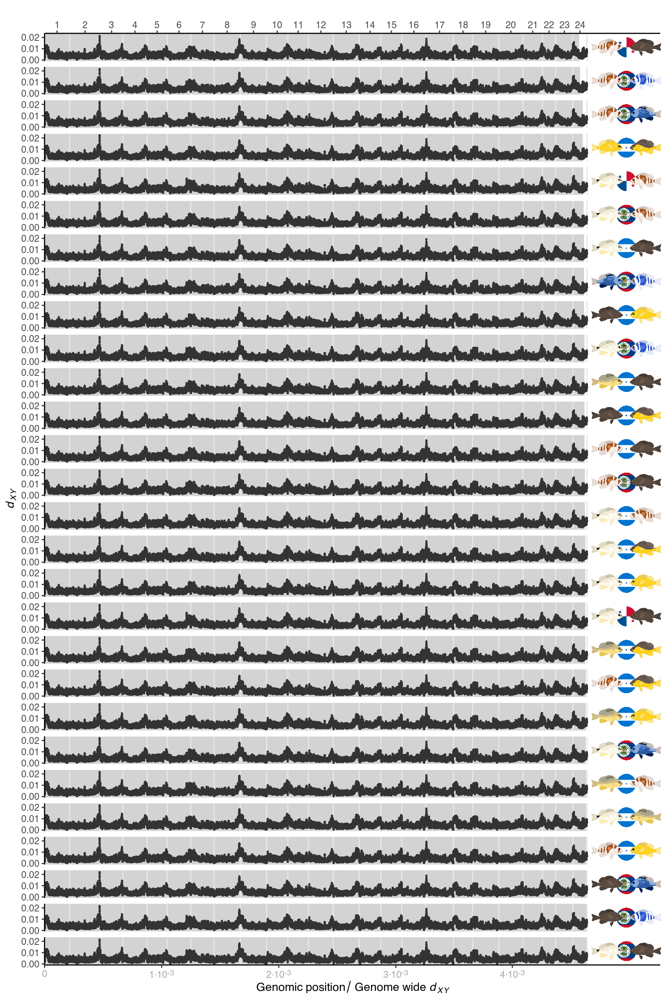

# Supplementary Figure 4


## Summary

This is the accessory documentation of Supplementary Figure 4.
The Figure can be recreated by running the **R** script `plot_SF4.R`:

```sh
cd $BASE_DIR

Rscript --vanilla R/fig/plot_SF4.R 2_analysis/dxy/50k/

```

## Details of `plot_SF4.R`

In the following, the individual steps of the R script are documented.
It is an executable R script that depends on the accessory R package [**GenomicOriginsScripts**](https://k-hench.github.io/GenomicOriginsScripts) and on the packages [**hypoimg**](https://k-hench.github.io/hypoimg) and [**ggtext**](https://wilkelab.org/ggtext/).

### Config

The scripts start with a header that contains copy & paste templates to execute or debug the script:


```r
#!/usr/bin/env Rscript
# run from terminal:
# Rscript --vanilla R/fig/plot_SF4.R 2_analysis/dxy/50k/
# ===============================================================
# This script produces Suppl. Figure 4 of the study "Ancestral variation,
# hybridization and modularity fuel a marine radiation"
# by Hench, McMillan and Puebla
# ---------------------------------------------------------------
# ===============================================================
# args <- c('2_analysis/dxy/50k/')
# script_name <- "R/fig/plot_SF4.R"
```

The next section processes the input from the command line.
It stores the arguments in the vector `args`.
The needed R packages are loaded and the script name and the current working directory are stored inside variables (`script_name`, `plot_comment`).
This information will later be written into the meta data of the figure to help us tracing back the scripts that created the figures in the future.

Then we drop all the imported information besides the arguments following the script name and print the information to the terminal.


```r
args <- commandArgs(trailingOnly=FALSE)
# setup -----------------------
library(GenomicOriginsScripts)
library(hypoimg)
library(ggtext)

cat('\n')
script_name <- args[5] %>%
  str_remove(.,'--file=')

plot_comment <- script_name %>%
  str_c('mother-script = ',getwd(),'/',.)

args <- process_input(script_name, args)
```

```r
#> ── Script: scripts/plot_SF4.R ────────────────────────────────────────────
#> Parameters read:
#> ★ 1: 2_analysis/dxy/50k/
#> ─────────────────────────────────────────── /current/working/directory ──
```

The path containing the $d_{XY}$ data is received and stored inside a more descriptive variable.


```r
# config -----------------------
dxy_path <- as.character(args[1])
```

This data path is then screened for input files.


```r
# locate dxy data files
files <- dir(dxy_path)
```

In the next step, all $d_{XY}$ files are read and the data is compiled into a single table.


```r
# load dxy data
data <- str_c(dxy_path,files) %>%
  purrr::map(get_dxy) %>%
  bind_rows() %>%
  set_names(., nm = c('scaffold', 'start', 'end', 'mid', 'sites', 'pi_pop1',
                      'pi_pop2', 'dxy', 'fst', 'GSTART', 'gpos', 'run'))
```

To be able to indicate the genome wide average $d_{XY}$ in the background of the plot, we summarize the $d_{XY}$ data for each pair wise comparison and store the summary in a new table.


```r
# create table for the indication of genome wide average dxy in the plot background
# (rescale covered dxy range to the extent of the genome)
global_bar <- data %>%
  # filter to non-overlaping windows only
  filter( start %% 50000 == 1) %>%
  select(sites, dxy, run) %>%
  group_by(run) %>%
  summarise(genome_wide_dxy = sum(sites*dxy)/sum(sites)) %>%
  arrange(genome_wide_dxy) %>%
  ungroup() %>%
  mutate(run = fct_reorder(.f = run, .x = genome_wide_dxy),
         scaled_dxy = genome_wide_dxy/max(genome_wide_dxy))
```

For the hamlet illustrations, we also create a table in which we assign each illustration the matching comparison.


```r
# prepare plot annotaton images
grob_tibble <-  global_bar %>%
  mutate(loc = str_sub(run,4,6),
         right = str_sub(run,1,3),
         left = str_sub(run,8,10)) %>%
  select(1,4:6) %>%
  pmap(.,plot_pair_run) %>%
  bind_rows()
```

The genome wide average $d_{XY}$ indicated in the plot background uses a secondary x-axis. 
As a preparation for this, we create the desired breaks and labels for the secondary axis.


```r
# prepare plotting elements --------
# pre-define secondary x-axis breaks
sc_ax <- scales::cbreaks(c(0,max(global_bar$genome_wide_dxy)),
                         scales::pretty_breaks(4))

# pre-define secondary x-axis labels
labels <- str_c(c("", sc_ax$breaks[2:5]*1000),
                c("0", rep("\u00B710^-3",4)))
```

Instead of ordering the species pairs by alphabet, we want the comparisons to be sorted by genome wide average $d_{XY}$.
For this we turn the comparisons into a factor.


```r
# sort pair-wise population comparisons by average genome wide dxy
data <- data %>%
  mutate(run = factor(run, levels = levels(global_bar$run)))
```

Then we can put together the final plot.


```r
# compose final figure
p <- ggplot()+
  # general plot structure separated by run
  facet_wrap( .~run, as.table = TRUE, ncol = 1, dir = 'v')+
  # add genome wide average dxy in the background
  geom_rect(data = global_bar %>% mutate(xmax = scaled_dxy * hypo_karyotype$GEND[24]),
            aes(xmin = 0, xmax = xmax, ymin = -Inf, ymax = Inf), color = rgb(1,1,1,0),fill = clr_below)+
  # add LG borders
  geom_vline(data = hypogen::hypo_karyotype, aes(xintercept = GEND), color = hypo_clr_lg)+
  # add dxy data points
  geom_point(data = data, aes(x = gpos, y = dxy),
             size=.2,color = plot_clr) +
  # add fish images
  geom_hypo_grob2(data = grob_tibble,
                  aes(grob = grob, rel_x = .945, rel_y = .5),
                  angle = 0, height = .9, width = .13)+
  # axis layout
  scale_x_hypo_LG(sec.axis =  sec_axis(~ ./hypo_karyotype$GEND[24],
                                       breaks = (sc_ax$breaks/max(global_bar$genome_wide_dxy))[1:5],
                                       labels = labels,
                                       name = expression(Genomic~position/~Genome~wide~italic(d[XY]))))+
  scale_y_continuous(name = expression(italic(d[XY])), breaks = c(0,.01, .02))+
  # set plot extent
  coord_cartesian(xlim = c(0, hypo_karyotype$GEND[24]*1.135))+
  # general plot layout
  theme_hypo()+
  theme(strip.text = element_blank(),
        legend.position = 'none',
        axis.title.x = element_text(),
        axis.text.x.bottom = element_markdown(colour = 'darkgray'))
```

<center>

</center>

Finally, we can export Supplementary Figure 4.


```r
# export final figure
hypo_save(filename = 'figures/SF4.png',
          plot = p,
          width = 8,
          height = 12,
          type = "cairo",
          comment = plot_comment)
```

---
