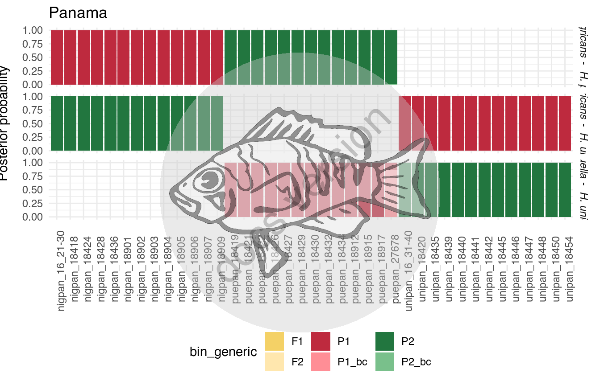
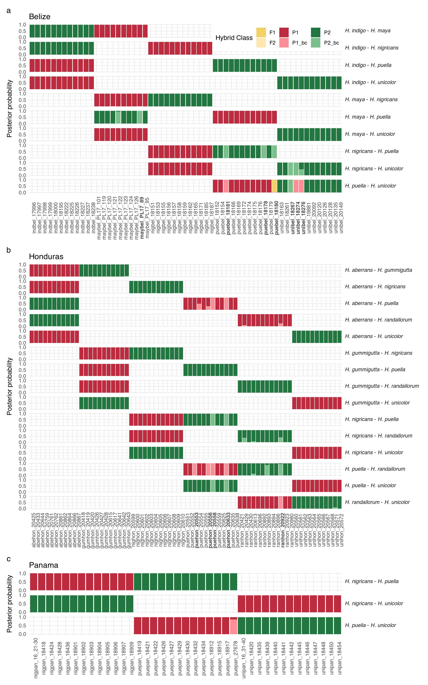

# Supplementary Figure 4


## Summary

This is the accessory documentation of Supplementary Figure .
The Figure can be recreated by running the **R** script `plot_SF4.R`:

```sh
cd $BASE_DIR

Rscript --vanilla R/fig/plot_SF4.R 2_analysis/newhyb/nh_input/NH.Results/

```

## Details of `plot_SF4.R`

In the following, the individual steps of the R script are documented.
It is an executable R script that depends on the accessory R package [**GenomicOriginsScripts**](https://k-hench.github.io/GenomicOriginsScripts), as well as on the packages [**ggtext**](https://wilkelab.org/ggtext/), [**hypoimg**](https://k-hench.github.io/hypoimg), [**paletteer**](https://emilhvitfeldt.github.io/paletteer/), [**patchwork**](https://patchwork.data-imaginist.com/) and [**prismatic**](https://emilhvitfeldt.github.io/prismatic/).

### Config

The scripts start with a header that contains copy & paste templates to execute or debug the script:


```r
#!/usr/bin/env Rscript
# run from terminal:
# Rscript --vanilla R/fig/plot_SF4.R 2_analysis/newhyb/nh_input/NH.Results/
# ===============================================================
# This script produces Suppl. Figure 4 of the study "Ancestral variation,
# hybridization and modularity fuel a marine radiation"
# by Hench, Helmkampf, McMillan and Puebla
# ---------------------------------------------------------------
# ===============================================================
# args <- c("2_analysis/newhyb/nh_input/NH.Results/")
# script_name <- "R/fig/plot_SF4.R"
```

The next section processes the input from the command line.
It stores the arguments in the vector `args`.
The needed R packages are loaded and the script name and the current working directory are stored inside variables (`script_name`, `plot_comment`).
This information will later be written into the meta data of the figure to help us tracing back the scripts that created the figures in the future.

Then we drop all the imported information besides the arguments following the script name and print the information to the terminal.


```r
args <- commandArgs(trailingOnly=FALSE)
# setup -----------------------
library(GenomicOriginsScripts)
library(prismatic)
library(paletteer)
library(patchwork)
library(ggtext)
library(hypoimg)
library(hypogen)
cat('\n')
script_name <- args[5] %>%
  str_remove(.,'--file=')

plot_comment <- script_name %>%
  str_c('mother-script = ',getwd(),'/',.)

cli::rule( left = str_c(crayon::bold('Script: '),crayon::red(script_name)))
args = args[7:length(args)]
cat(' ')
cat(str_c(crayon::green(cli::symbol$star),' ', 1:length(args),': ',crayon::green(args),'\n'))
cli::rule(right = getwd())
```

```r
#> ── Script: scripts/plot_SF4.R ────────────────────────────────────────────
#> Parameters read:
#> ★ 1: 2_analysis/newhyb/nh_input/NH.Results/
#> ─────────────────────────────────────────── /current/working/directory ──
```

The directory containing the hybridization data is received and stored in a variable.


```r
# config -----------------------
base_dir <- as.character(args[1])
```

All the hybridization-subfolders are located (there is one per pair wise `newhybrids` run).


```r
# locate hybridization data files
folders <- dir(base_dir)
```

Then we run the high-level function `GenomicOriginsScripts::plot_loc()` which
reads in all the hybridization data of a given sampling location and creates the respective figure panel.


```r
# load data and create plots by location
p_loc <- c("bel", "hon", "pan") %>%
  map(plot_loc)
```

As an example we can have a look at the result for `plot_loc("pan")`:

<center>

</center>

All three panels are collected and the final Figure is composed using the pacckage [**patchwork**](https://patchwork.data-imaginist.com/):


```r
# compose figure from the individual panels
p <- (p_loc[[1]] +  guides(fill = guide_legend(title = "Hybrid Class")) + theme_hyb(legend.position = c(1,1)) ) +
  (p_loc[[2]] + theme_hyb() ) +
  (p_loc[[3]] + theme_hyb() )  +
  plot_layout(ncol = 1, heights = c(10,15,3) %>% label_spacer())+
  plot_annotation(tag_levels = 'a')
```

<center>

</center>

Finally, we can export Supplementary Figure 4.


```r
# export the final figure
hypo_save(filename = "figures/SF4.pdf",
       plot = p,
       height = 16,
       width = 10,
       device = cairo_pdf,
       comment = plot_comment)
```

---
