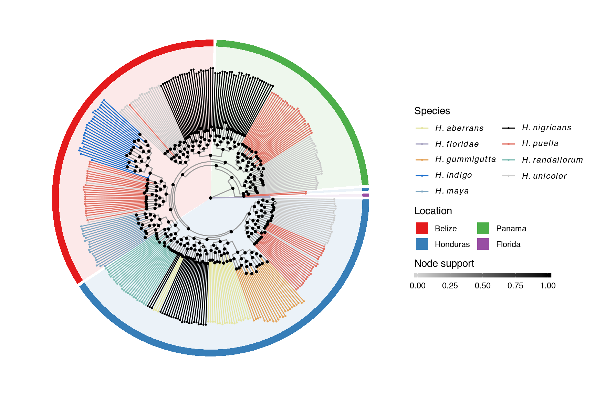

# Supplementary Figure 6


## Summary

This is the accessory documentation of Supplementary Figure 6.
The Figure can be recreated by running the **R** script `plot_SF6.R`:

```sh
cd $BASE_DIR

Rscript --vanilla R/fig/plot_SF6.R 2_analysis/fasttree/ no_outgroups.all.whg.SNP.tree

```

## Details of `plot_SF6.R`

In the following, the individual steps of the R script are documented.
It is an executable R script that depends on the accessory R package [**GenomicOriginsScripts**](https://k-hench.github.io/GenomicOriginsScripts), as well as on the packages [**hypoimg**](https://k-hench.github.io/hypoimg),  [**geomfactory**](https://k-hench.github.io/geomfactory), [**ape**](http://ape-package.ird.fr/), [**ggtree**](https://yulab-smu.github.io/treedata-book/) and [**phytools**](https://github.com/liamrevell/phytools).

### Config

The scripts start with a header that contains copy & paste templates to execute or debug the script:


```r
#!/usr/bin/env Rscript
# run from terminal:
# Rscript --vanilla R/fig/plot_SF6.R 2_analysis/fasttree/ no_outgroups.all.whg.SNP.tree
# ===============================================================
# This script produces Suppl. Figure 6 of the study "Ancestral variation,
# hybridization and modularity fuel a marine radiation"
# by Hench, McMillan and Puebla
# ---------------------------------------------------------------
# ===============================================================
# args <- c('2_analysis/fasttree/', 'no_outgroups.all.whg.SNP.tree')
# script_name <- "R/fig/plot_SF6.R"
```

The next section processes the input from the command line.
It stores the arguments in the vector `args`.
The needed R packages are loaded and the script name and the current working directory are stored inside variables (`script_name`, `plot_comment`).
This information will later be written into the meta data of the figure to help us tracing back the scripts that created the figures in the future.

Then we drop all the imported information besides the arguments following the script name and print the information to the terminal.


```r
args <- commandArgs(trailingOnly=FALSE)
# setup -----------------------
library(ggtree)      # remotes::install_github("YuLab-SMU/ggtree")
library(ape)
library(phytools)
library(hypoimg)
library(geomfactory) # remotes::install_github("k-hench/geomfactory")
library(GenomicOriginsScripts)

cat('\n')
script_name <- args[5] %>%
  str_remove(.,'--file=')

plot_comment <- script_name %>%
  str_c('mother-script = ',getwd(),'/',.)

args <- process_input(script_name, args)
```

```r
#> ── Script: scripts/plot_SF6.R ────────────────────────────────────────────
#> Parameters read:
#> ★ 1: 2_analysis/fasttree/
#> ★ 2: no_outgroups.all.whg.SNP.tree
#> ─────────────────────────────────────────── /current/working/directory ───
```

The path containing the phylogeny and the specific tree file are received and stored inside more descriptive variables.
Also, an additional color-scale to indicate the node-support is initiated.


```r
# config -----------------------
tree_path <- as.character(args[1])
tree_file <- as.character(args[2])
geomfactory::factory_geom_point('support')
```

Then, the phylogeny is loaded.


```r
# load phylogenetic tree
tree_select <- get_tree(loc = 'all', file = tree_file, tree_dir = tree_path)$tree[[1]]
```

To prepare the phylogeny plot, specific color adjustments are made on the pre-defined defaults (from **GenomicOriginsScripts**).


```r
# adjust predefined colors and species set
spec_list <- list('uni','pue','may','nig','gem')
clr_plt <- c(clr2, gem = "#414D6BFF", ungrouped = "darkgray")
clr_plt['may'] <- 'darkblue'
```

Then, for a clean representation, a specific set of nodes of the phylogenetic tree are rotated.


```r
# adjust tree layout by rotating specific branches for visualization
tree_rot <- ggtree(tree_select, layout = 'circular') %>%
  ggtree::rotate(463) %>%
  ggtree::rotate(551) %>%
  ggtree::rotate(653) %>%
  ggtree::rotate(397) %>%
  ggtree::rotate(356) %>%
  ggtree::rotate(415) %>%
  ggtree::rotate(419) %>%
  ggtree::rotate(663) %>%
  .$data
```

The phylogeny contains two entries per sample (one per pseudo-haplotype).
For plotting, we drop the haplotype suffix (`"_A"` and `"_B"`) and detect the branches leading to tips of the tree (for coloration).


```r
# drop "_A/_B" suffix from the pseudo-haplotype labels (crop to sample ID)
# also: set branch class
tree_df <- tree_rot %>%
  mutate(id = str_remove(label,"_[A,B]"),
         spec = str_sub(id,start = -6,end = -4) %>% str_remove(.,"[0-9.]{1,3}$")%>% str_remove(.," "),
         spec = ifelse(spec == "",'ungrouped',spec),
         geo = str_sub(id,start = -3,end = -1) %>% str_remove(.,"[0-9]{1,3}$")%>% str_remove(.," "),
         geo = ifelse(geo == "",'ungrouped',geo),
         grouped = ifelse(spec == 'ungrouped', 'ungrouped', 'species'))
```

We are going to display the phylogenetic tree in a circular representation - here we set this mode.


```r
# pre-set tree layout
lyout <- 'circular'
```

Our final figure will indicate the sample location as colored blocks in the background.
To prepare this we create a small table containing the continuous stretches of samples from the same location.


```r
# prepare colored plot background (indication of sampling-location)
geo_chunks <- tree_df %>%
  filter(isTip) %>%
  select(y,spec,geo) %>%
  arrange(y) %>%
  mutate(check = 1-(geo == lag(geo,default = '')),
         chunk = cumsum(check)) %>%
  group_by(chunk) %>%
  summarise(geo = geo[1],
            ymin = min(y),
            ymax = max(y))
```

Then, we set several color schemes and their labels to be used in the plot.


```r
# set color scheme
c_vals <- c(ungrouped = rgb(.6, .6, .6),
            R = rgb(.6, .6, .6), clr2 )
# set color labels
c_labs <- c(R = "",ungrouped = "",sp_labs)
# set color legend entries
c_breaks <- c(NA, NA, names(clr2))
```

At this point we can put together the final figure.


```r
# compose final figure ---------------
# initialize tree plot
p <- ggtree(tree_df, layout = lyout,
         aes(color = spec), color = NA)+
  # add colored background
  geom_rect(inherit.aes = FALSE,
            data = geo_chunks,
            aes(xmin = .0035, xmax = .35,
                ymin = ymin, ymax = ymax,
                fill = geo), size = 2)+
  # make baground color under the tree more faint
  geom_rect(inherit.aes = FALSE,
            data = tibble(xmax = .335),
            aes(xmin = -Inf, xmax = xmax,
                ymin = -Inf, ymax = Inf),
            fill = rgb(1, 1 ,1 ,.9), size = 2)+
  # add brach layer
  geom_tree(data = tree_df,
            layout = lyout) +
  # add leafs/ samples (pseudo-haplotypes)
  geom_tippoint(size = .4)+
  # add node-support layer
  geom_nodepoint_support(data = tree_df %>% filter(!isTip),
                         aes(support_f = as.numeric(label)),
                         size = 1,
                         shape = 21)+
  # set axis layout
  scale_x_continuous(expand = c(0,0))+
  scale_y_continuous(expand = c(0,.5))+
  # set branch color scheme
  scale_color_manual(values = c_vals,
                     breaks = c_breaks,
                     labels = c_labs)+
  # set sample color scheme
  scale_fill_manual(values = clr_loc,
                    breaks = names(clr_loc),
                    labels = loc_names)+
  # set node-support color scheme
  scale_support_f_continuous(low = 'lightgray',
                             high = 'black',
                             guide = guide_colourbar_support(title = 'Node support',
                                                             direction = 'horizontal',
                                                             order = 3,
                                                             title.position = 'top',
                                                             barheight = unit(5, 'pt'),
                                                             barwidth = unit(150, 'pt')))+
  # customize legend entries
  guides(fill = guide_legend(title = 'Location', ncol = 2, order = 2),
         color = guide_legend(title = 'Species',
                              ncol = 2,
                              order = 1,
                              label.hjust = 0))+
  # set general plot layout
  theme_void()
```

<center>

</center>

Finally, we can export Supplementary Figure 6.


```r
# export final figure
hypo_save(filename = 'figures/SF6.pdf',
          plot = p,
          width = 9,
          height = 6,
          comment = plot_comment)
```

---
