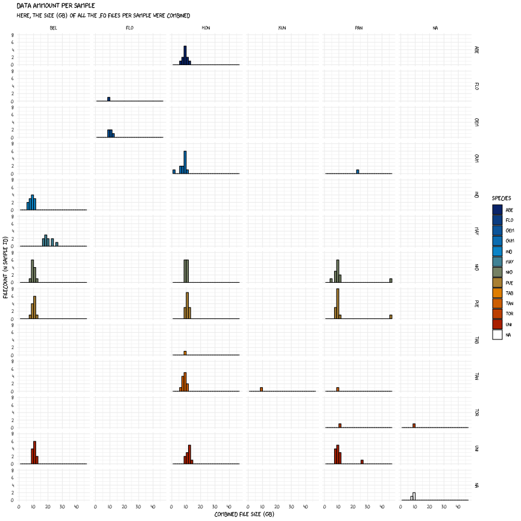

# The metadata folder

This folder contains metadata which describes the raw sequencing data contained in the *data* folder.

Below is a short summary of the sample compostition:

Summary on *per-file* (pair) basis:

|Location  |abe |flo |gem |gum |ind |may |nig |pue |tab |tan |tor |uni |N/A | Total|
|:---------|:---|:---|:---|:---|:---|:---|:---|:---|:---|:---|:---|:---|:---|-----:|
|Belize    |    |    |    |    |12  |26  |12  |12  |    |    |    |12  |    |    74|
|Florida   |    |1   |5   |    |    |    |    |    |    |    |    |    |    |     6|
|Honduras  |11  |    |    |12  |    |    |12  |13  |1   |12  |    |11  |    |    72|
|Kuna Yala |    |    |    |    |    |    |    |    |    |1   |    |    |    |     1|
|Panama    |    |    |    |2   |    |    |16  |15  |    |1   |1   |14  |    |    49|
|N/A       |    |    |    |    |    |    |    |    |    |    |1   |    |3   |     4|
|Total     |11  |1   |5   |14  |12  |26  |40  |40  |1   |14  |2   |37  |3   |   206|

Summary on *per-sample-id* basis:

|Location  |abe |flo |gem |gum |ind |may |nig |pue |tab |tan |tor |uni |N/A | Total|
|:---------|:---|:---|:---|:---|:---|:---|:---|:---|:---|:---|:---|:---|:---|-----:|
|Belize    |    |    |    |    |12  |10  |12  |12  |    |    |    |12  |    |    58|
|Florida   |    |1   |5   |    |    |    |    |    |    |    |    |    |    |     6|
|Honduras  |11  |    |    |12  |    |    |12  |13  |1   |12  |    |11  |    |    72|
|Kuna Yala |    |    |    |    |    |    |    |    |    |1   |    |    |    |     1|
|Panama    |    |    |    |1   |    |    |13  |13  |    |1   |1   |13  |    |    42|
|N/A       |    |    |    |    |    |    |    |    |    |    |1   |    |3   |     4|
|Total     |11  |1   |5   |13  |12  |10  |37  |38  |1   |14  |2   |36  |3   |   183|

---

