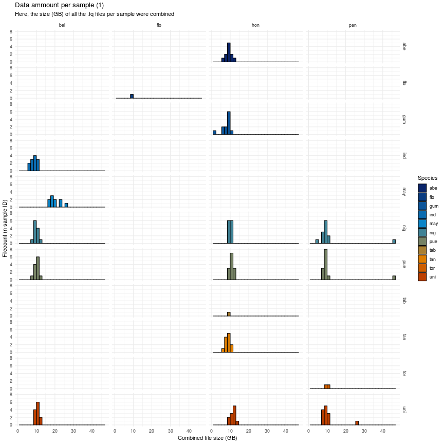
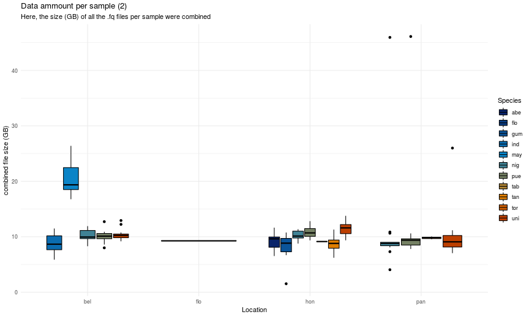

# The metadata folder

This folder contains metadata which describes the raw sequencing data contained in the *data* folder.

Below is a short summary of the sample compostition:

Summary on *per-file* (pair) basis:

|  Location| abe| flo| gem| gum| ind| may| nig| pue| tab| tan| tor| uni| Total|
|---------:|---:|---:|---:|---:|---:|---:|---:|---:|---:|---:|---:|---:|-----:|
|    Belize|    |    |    |    |  12|  26|  12|  12|    |    |    |  12|    74|
|   Florida|    |   1|   5|    |    |    |    |    |    |    |    |    |     6|
|  Honduras|  11|    |    |  12|    |    |  12|  13|   1|  12|    |  11|    72|
| Kuna Yala|    |    |    |    |    |    |    |    |    |   1|    |    |     1|
|    Mexico|    |    |    |    |    |    |    |   3|    |    |    |    |     3|
|    Panama|    |    |    |   2|    |    |  16|  15|    |   1|   2|  14|    50|
|     Total|  11|   1|   5|  14|  12|  26|  40|  43|   1|  14|   2|  37|   206|

Summary on *per-sample-id* basis:

|  Location| abe| flo| gem| gum| ind| may| nig| pue| tab| tan| tor| uni| Total|
|---------:|---:|---:|---:|---:|---:|---:|---:|---:|---:|---:|---:|---:|-----:|
|    Belize|    |    |    |    |  12|  10|  12|  12|    |    |    |  12|    58|
|   Florida|    |   1|   5|    |    |    |    |    |    |    |    |    |     6|
|  Honduras|  11|    |    |  12|    |    |  12|  13|   1|  12|    |  11|    72|
| Kuna Yala|    |    |    |    |    |    |    |    |    |   1|    |    |     1|
|    Mexico|    |    |    |    |    |    |    |   3|    |    |    |    |     3|
|    Panama|    |    |    |   1|    |    |  13|  13|    |   1|   2|  13|    43|
|     Total|  11|   1|   5|  13|  12|  10|  37|  41|   1|  14|   2|  36|   183|

---

