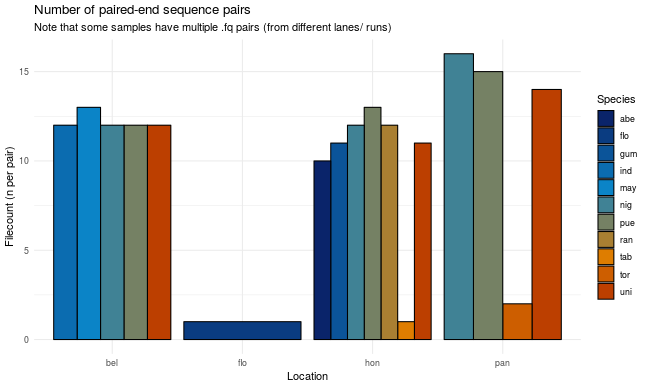
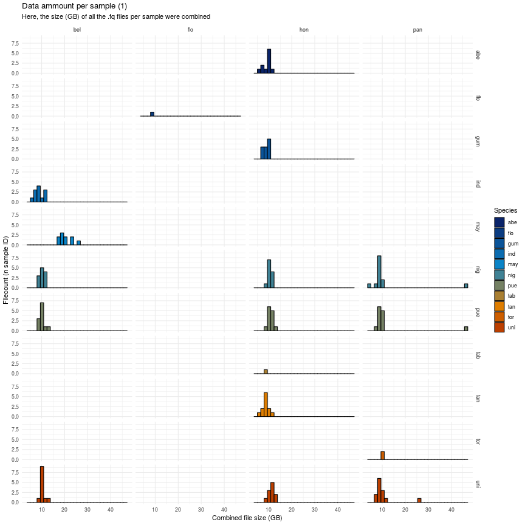
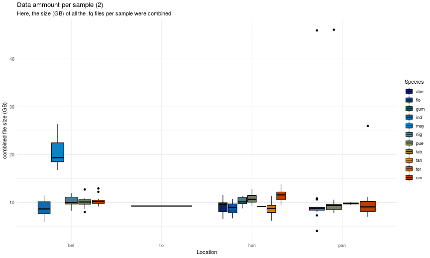

# The metadata folder

This folder contains metadata which describes the raw sequencing data contained in the *data* folder.

Below is a short summary of the sample compostition:

Summary on *per-file* (pair) basis:

| Location| abe| flo| gum| ind| may| nig| pue| tab| tan| tor| uni| Total| Species|
|--------:|---:|---:|---:|---:|---:|---:|---:|---:|---:|---:|---:|-----:|-------:|
|   Belize|    |    |    |  12|  26|  12|  12|    |    |    |  12|    74|       5|
|  Florida|    |   1|    |    |    |    |    |    |    |    |    |     1|       1|
| Honduras|  10|    |  11|    |    |  12|  13|   1|  12|    |  11|    70|       7|
|   Panama|    |    |    |    |    |  16|  15|    |    |   2|  14|    47|       4|
|    Total|  10|   1|  11|  12|  26|  40|  40|   1|  12|   2|  37|   192|      11|

Summary on *per-sample-id* basis:

| Location| abe| flo| gum| ind| may| nig| pue| tab| tan| tor| uni| Total| Species|
|--------:|---:|---:|---:|---:|---:|---:|---:|---:|---:|---:|---:|-----:|-------:|
|   Belize|    |    |    |  12|  10|  12|  12|    |    |    |  12|    58|       5|
|  Florida|    |   1|    |    |    |    |    |    |    |    |    |     1|       1|
| Honduras|  10|    |  11|    |    |  12|  13|   1|  12|    |  11|    70|       7|
|   Panama|    |    |    |    |    |  13|  13|    |    |   2|  13|    41|       4|
|    Total|  10|   1|  11|  12|  10|  37|  38|   1|  12|   2|  36|   170|      11|

---

